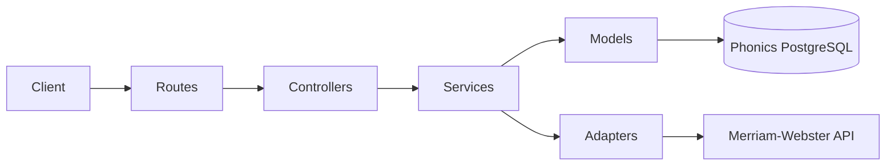

# Phonics microservice

Word phonetics for ReadOn: tokenizes story text with **compromise** POS tagging, keeps **one dictionary sense per vocabulary candidate**, caches rows in PostgreSQL (`phonics` DB), and returns flashcard DTOs.

## Behavior (v2)

- **One flashcard per processed token** after preprocessing (no multi-sense fan-out).
- **One `Phonics_Words` row per `Normalized_Word`** (global cache).
- **`Word_Type`**: `acronym` | `noun` | `verb` | `adjective` | `adverb` | `unknown` — from acronym heuristics + compromise, stored in DB and returned as `wordType` in API responses.
- **Merriam-Webster**: at most **one** HTTP lookup per candidate; `selectBestMwEntry` picks a single best `PhoneticsEntry` from the raw response.
- **`Meaning`**: first usable `shortdef` only.
- **`Breakdown`**: pronunciation (`mw` / `ipa` from `prs`) only; **never** a copy of `Meaning` (see `utils/breakdown.ts`).

## Architecture

- **Routes / handlers** (`routes/handlers.ts`): HTTP-agnostic entrypoints for Next.js API routes.
- **Controllers** (`controllers/`): Zod validation, HTTP status mapping.
- **Services** (`services/phonicsService.ts`): Preprocess → cache lookup → MW call → sense selection → upsert → story links.
- **Models** (`models/`): **Only** PostgreSQL access (`pg`).
- **Adapters** (`adapters/merriamWebsterAdapter.ts`): Maps MW `sd3` JSON → `PhoneticsEntry[]` (raw senses).
- **Utils**: `preprocessStory.ts` (stopwords, acronym, compromise), `selectBestMwEntry.ts`, `audioUrl.ts`, `breakdown.ts`.



## Endpoints

| Method | Path | Description |
|--------|------|-------------|
| `POST` | `/api/phonics/process` | `{ storyId, storyText }` |
| `GET` | `/api/phonics/story/:storyId` | Flashcards for a story |

Response flashcard fields include **`wordType`**. `breakdown` may be `null`.

## Environment

| Variable | Purpose |
|----------|---------|
| `MERRIAM_WEBSTER_API_KEY` | Intermediate Dictionary (`sd3`) |
| `PHONICS_DATABASE_URL` or `PHONICS_DB_*` | Postgres `phonics` database |
| `PHONICS_DB_SSL` | `true` for many direct Cloud SQL connections |

## Database schema

Canonical SQL: `db/migrations/001_init_phonics.sql` (`CREATE TABLE IF NOT EXISTS`).

**Destructive reset** (drops both tables and recreates — clears all phonics data):

```bash
npm run phonics:db:reset
```

Idempotent apply (no drop): `npm run phonics:db:bootstrap`

### Tables

**`Phonics_Words`**: `Word_ID` (BIGSERIAL), `Word`, `Normalized_Word` **UNIQUE**, `Word_Type` (CHECK), `Meaning`, `Breakdown` (nullable), `Audio_URL`, timestamps.

**`Story_Phonics_Words`**: `Story_ID`, `Word_ID` FK, `Display_Order`, **UNIQUE (`Story_ID`, `Word_ID`)**.

### Connectivity

Cloud SQL instance `readon-sql` (`readon-492106:us-central1:readon-sql`). Use Cloud SQL Auth Proxy (`127.0.0.1`) and/or public IP + authorized networks — see `.env.example`.

## Provider

- Intermediate Dictionary API: `https://www.dictionaryapi.com/api/v3/references/sd3/json/...`
- Audio URLs per Merriam-Webster JSON documentation (`utils/audioUrl.ts`).
- TODO: Branding / attribution per API license before production UI.

## Testing

```bash
npm test
```

## Assumptions

- **Proper-noun omission** uses compromise `#ProperNoun` / `#Person` / `#Place` — best-effort; edge cases may slip through.
- POS tagging on **single-word** `nlp(displayWord)` may be noisier than full-sentence parsing.
